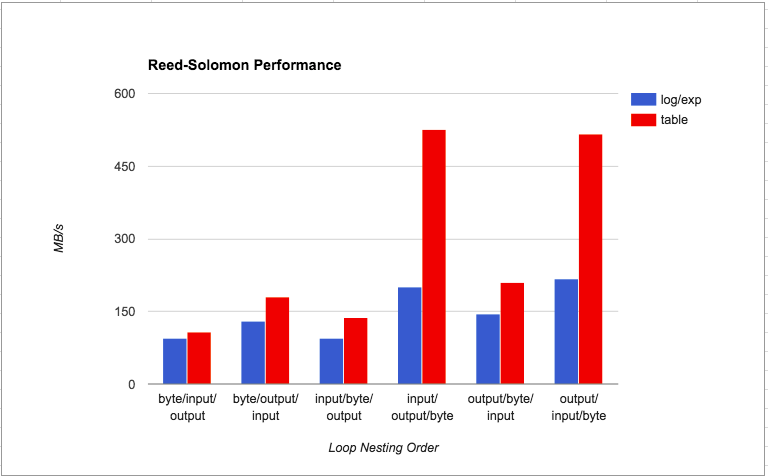

## My adding interface and implemention
First, I read and learn the code of this excellent project. Then, on the basis of this great work, I added the interface and implementation of byte array data, so that we can implement the byte array erasure algorithm. You can apply it to the erasure processing of network data transmission, the efficiency and ability of the algorithm is great.

首先，我阅读并学习这个优秀项目的代码，然后，我在这个很棒的工作的基础上添加了处理字节数组数据的接口和实现，以便我们可以实现字节数组纠删算法的处理。你可以将其应用到网络数据传输的纠删处理上，算法的效率和能力很棒。

# JavaReedSolomon

This is a simple and efficient Reed-Solomon implementation in Java,
which was originally built at [Backblaze](https://www.backblaze.com).
There is an overview of how the algorithm works in my [blog
post](https://www.backblaze.com/blog/reed-solomon/).

The ReedSolomon class does the encoding and decoding, and is supported
by Matrix, which does matrix arithmetic, and Galois, which is a finite
field over 8-bit values.

For examples of how to use ReedSolomon, take a look at SampleEncoder
and SampleDecoder.  They show, in a very simple way, how to break a
file into shards and encode parity, and then how to take a subset of
the shards and reconstruct the original file.

There is a Gradle build file to make a jar and run the tests.  Running
it is simple.  Just type: `gradle build`

We would like to send out a special thanks to James Plank at the
University of Tennessee at Knoxville for his useful papers on erasure
coding.  If you'd like an intro into how it all works, take a look at
[this introductory paper](http://web.eecs.utk.edu/~plank/plank/papers/SPE-9-97.html).

This project is limited to a pure Java implementation.  If you need
more speed, and can handle some assembly-language programming,
you may be interested in using the Intel SIMD instructions to speed
up the Galois field multiplication.  You can read more about that 
in the paper on [Screaming Fast Galois Field Arithmetic](http://www.kaymgee.com/Kevin_Greenan/Publications_files/plank-fast2013.pdf).


## Performance Notes

The performance of the inner loop depends on the specific processor
you're running on.  There are twelve different permutations of the
loop in this library, and the ReedSolomonBenchmark class will tell
you which one is faster for your particular application.  The number
of parity and data shards in the benchmark, as well as the buffer
sizes, match the usage at Backblaze.  You can set the parameters of
the benchmark to match your specific use before choosing a loop
implementation. 

These are the speeds I got running the benchmark on a Backblaze
storage pod:

```
    ByteInputOutputExpCodingLoop         95.2 MB/s
    ByteInputOutputTableCodingLoop      107.0 MB/s
    ByteOutputInputExpCodingLoop        130.3 MB/s
    ByteOutputInputTableCodingLoop      181.4 MB/s
    InputByteOutputExpCodingLoop         94.4 MB/s
    InputByteOutputTableCodingLoop      138.3 MB/s
    InputOutputByteExpCodingLoop        200.4 MB/s
    InputOutputByteTableCodingLoop      525.7 MB/s
    OutputByteInputExpCodingLoop        143.7 MB/s
    OutputByteInputTableCodingLoop      209.5 MB/s
    OutputInputByteExpCodingLoop        217.6 MB/s
    OutputInputByteTableCodingLoop      515.7 MB/s
```


